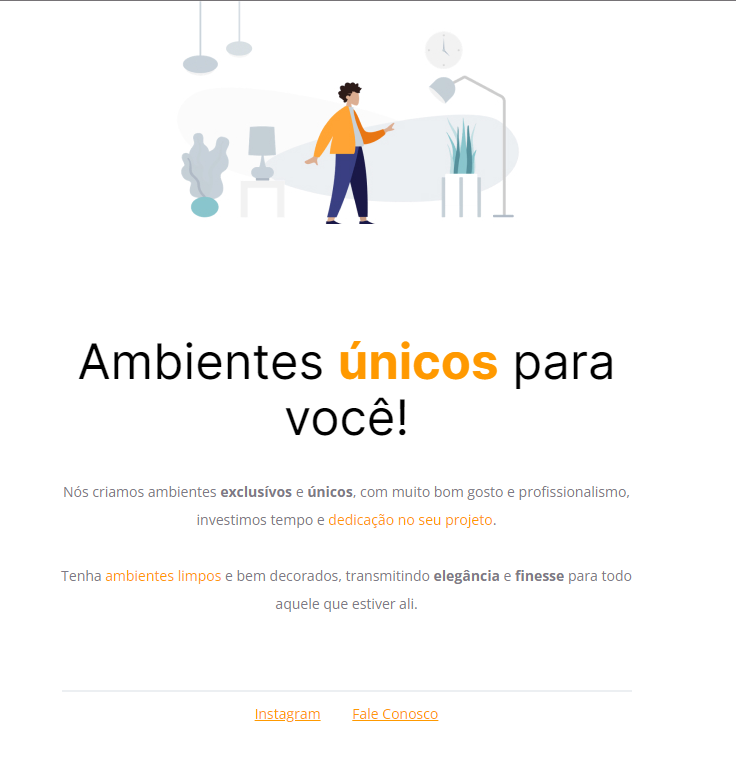

# Explorer Project 1

## Overview

Welcome to the first project of the Explore Course by Rocketseat. This project is designed to introduce foundational web development concepts, focusing on HTML and CSS. It's a hands-on project where you'll learn by doing, creating a visually appealing and functionally robust webpage.

### Key Learning Points

- **HTML Tags**: Understanding both inline and block-type tags.
- **CSS Concepts**: Delving into selectors, main attributes, and the use of fonts.
- **Layout Techniques**: Learning about `align-items`, `position` and other layout-centric properties.

## Project Resources

### Design

- **Figma**: The design mockup of the project is available on [Figma](<https://www.figma.com/file/AMfLIbFhcLnQvzzakIt6tu/Explorer---Projeto-01-(Copy)?node-id=0%3A1&mode=dev>). Here you can view the intended design and layout.

### Implementation

- **CodePen**: The live code implementation can be found on [CodePen](https://codepen.io/giovannivicentin/pen/ZEwoQXw). This includes the HTML and CSS code used to build the project.
- **Screenshot**: A visual representation of the completed project is available [here](https://i.imgur.com/9nlFQsZ.jpg).

### Project Structure

- `images/`: Contains image files used in the project. Below is a screenshot of the completed project:
  

## Getting Started

To get started with this project, you can clone the repository and explore the files. The main HTML file is structured with various tags, each serving a specific purpose in the layout. The CSS file contains styles that are applied to these tags, using selectors to manipulate their appearance and behavior.

## Contributing

Contributions to this project are welcome. Whether it's improving the documentation, suggesting new features, or reporting bugs, your input is valuable.
